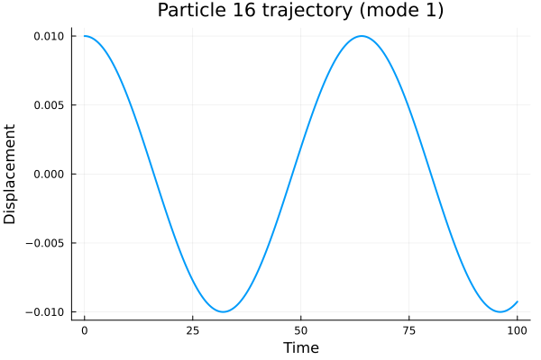
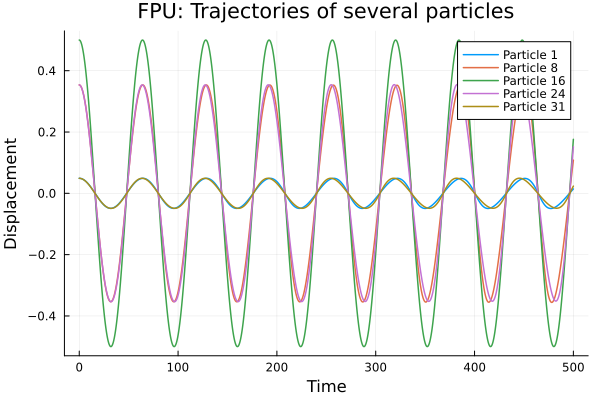
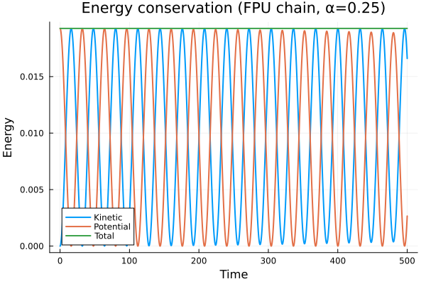
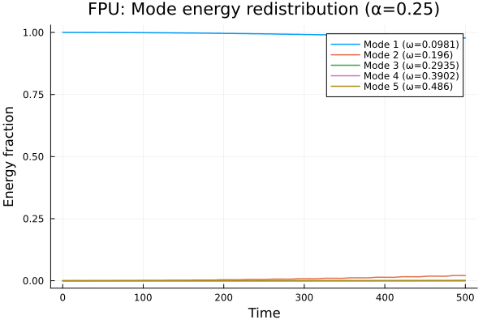
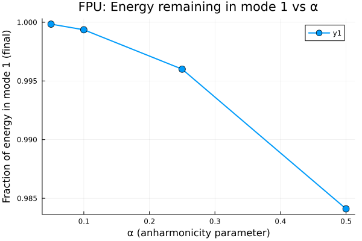

---
author:
  - name: Черная София Витальевна
    email: 1132236043@pfur.ru
    affiliation:
      - name: Российский университет дружбы народов
        country: Российская Федерация
        postal-code: 117198
        city: Москва
        address: ул. Миклухо-Маклая, д. 6
  - name: Улитина Мария Максимовна
    email: 1132236002@pfur.ru
    affiliation:
      - name: Российский университет дружбы народов
        country: Российская Федерация
        postal-code: 117198
        city: Москва
        address: ул. Миклухо-Маклая, д. 6

title: "Моделирование колебаний гармонической и ангармонической цепочек"
subtitle: "Проект 2.8. Этап 3: Комплексы программ"
license: "CC BY"
date: today
date-format: "YYYY-MM-DD"
---

# Вводная часть

## Актуальность

- Колебательные системы — основа многих физических явлений
- От линейных (струны, кристаллы) до нелинейных (плазма, биомолекулы)
- Задача Ферми–Пасты–Улама — классика нелинейной физики
- Важно понимать, как нелинейность меняет поведение системы

## Цель работы

1. Разработать программу для моделирования одномерной цепочки частиц
2. Проверить модель на гармоническом случае
3. Исследовать ангармоническую цепочку (задача FPU)
4. Проанализировать перераспределение энергии между модами
5. Изучить зависимость от параметра ангармонизма α

# Теоретическая часть

## Модель гармонической цепочки

- N частиц массой m, соединённых пружинами жесткости k
- Крайние частицы закреплены на стенках
- Уравнение движения: `m·ÿ_i = k·(y_{i+1} - 2y_i + y_{i-1})`
- Решения — стоячие волны (собственные моды)

**Собственные частоты:**

`ω_l = 2·√(k/m)·sin(l·π / (2·(N+1)))`

## Задача Ферми–Пасты–Улама (FPU)

**Нелинейная поправка в силу пружины:**

`F = -k·x·(1 - α·x/d)`

- α — параметр ангармонизма
- При α > 0: сила растёт медленнее при растяжении и быстрее при сжатии
- Нелинейность приводит к взаимодействию мод

## Численный метод

**Скоростной алгоритм Верле:**

1. Обновление позиций: `yⁿ⁺¹ = yⁿ + vⁿ·dt + aⁿ·dt²/2`
2. Расчёт новых ускорений: `aⁿ⁺¹ = F(yⁿ⁺¹)/m`
3. Обновление скоростей: `vⁿ⁺¹ = vⁿ + (aⁿ + aⁿ⁺¹)·dt/2`

- 3-й порядок точности
- Хорошо сохраняет энергию

## Дискретное преобразование Фурье

Для анализа энергий мод используется синусное ДПФ:

`b_l = (2/N)·∑ y(x_j)·sin(2π·j·l/L)`

Энергия l-й моды:

`E_l = ½·(db_l/dt)² + ½·ω_l²·b_l²`

# Результаты: гармоническая цепочка

## Траектория центральной частицы

- Синусоидальная форма
- Частота совпадает с теоретической
- Отклонение менее 0.001%

## Сохранение энергии

- Полная энергия постоянна
- Обмен между кинетической и потенциальной
- Относительная ошибка < 0.0001%

## Энергии мод

- Энергия только в первой моде
- Высшие моды на уровне нуля
- Линейная система: моды не взаимодействуют

# Результаты: ангармоническая цепочка (FPU)

## Траектория центральной частицы

- Форма искажена (не чистая синусоида)
- Влияние нелинейности хорошо заметно

## Траектории нескольких частиц

- Разные амплитуды у разных частиц
- Краевые частицы колеблются с меньшей амплитудой
- Нелинейность искажает форму

## Сохранение энергии (FPU)

- Полная энергия сохраняется с высокой точностью
- Метод Верле работает и для нелинейного случая
- Относительная ошибка < 0.00025%

## Перераспределение энергии между модами

- Энергия перекачивается из моды 1 в моды 2, 3, 4
- Вторая мода достигает ~2% от полной энергии
- Эффект Ферми–Пасты–Улама: энергия не распределяется равномерно

## Зависимость от параметра α

- При малых α — почти вся энергия в моде 1
- С ростом α — больше перекачки в высшие моды
- При α=0.5 остаётся ~98.5% энергии в моде 1

# Сравнение

## Гармоническая vs Ангармоническая цепочка

| Характеристика | Гармоническая | Ангармоническая (FPU) |
|----------------|---------------|----------------------|
| Форма колебаний | Синусоидальная | Искажённая |
| Взаимодействие мод | Отсутствует | Есть |
| Перераспределение энергии | Нет | Моды 2,3,4 возбуждаются |
| Зависимость от α | Нет | Есть |

# Выводы

## Результаты работы

1. Разработан программный комплекс на Julia для моделирования цепочки частиц
2. Проведена верификация на гармоническом случае:
   - энергия сохраняется с высокой точностью
   - частота совпадает с теоретической
3. Исследована ангармоническая цепочка (задача Ферми–Пасты–Улама):
   - получено перераспределение энергии из первой моды в высшие
   - построена зависимость от параметра α

## Ключевые выводы

- **Верификация пройдена** — модель работает корректно
- **Нелинейность меняет поведение** — возникает взаимодействие мод
- **Эффект FPU** — энергия не распределяется равномерно, остаётся в первых модах
- **Чем больше α, тем сильнее перекачка** энергии

## Итог

Разработанная программа позволяет:
- Моделировать колебания цепочек с различными параметрами
- Анализировать распределение энергии по модам
- Исследовать нелинейные эффекты в задачах физики

Спасибо за внимание!
