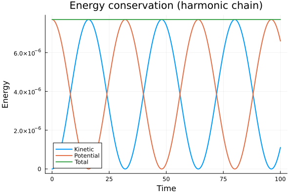
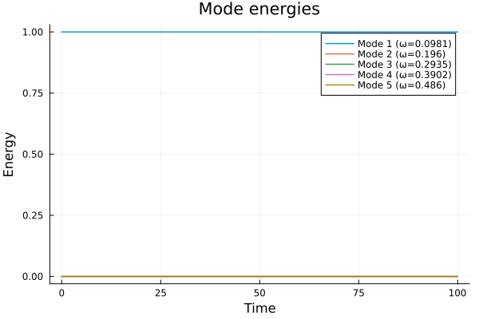
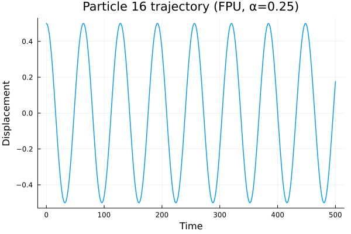

---
## Author
author:
  - name: Черная София Витальевна
    email: 1132236043@pfur.ru
    affiliation:
      - name: Российский университет дружбы народов
        country: Российская Федерация
        postal-code: 117198
        city: Москва
        address: ул. Миклухо-Маклая, д. 6
  - name: Улитина Мария Максимовна
    email: 1132236002@pfur.ru
    affiliation:
      - name: Российский университет дружбы народов
        country: Российская Федерация
        postal-code: 117198
        city: Москва
        address: ул. Миклухо-Маклая, д. 6

## Title
title: "Моделирование колебаний гармонической и ангармонической цепочек"
subtitle: "Проект 2.8. Этап 3: Комплексы программ"
license: "CC BY"
date: today
date-format: "YYYY-MM-DD"

format:
  pdf:
    engine: xelatex
    mainfont: "DejaVu Serif"
    sansfont: "DejaVu Sans"
    monofont: "DejaVu Sans Mono"
    monofontoptions: "Scale=0.8"
    keep-tex: true
---

# Цель работы

Разработать программную реализацию для моделирования динамики одномерной цепочки связанных частиц в двух постановках:

1. **Гармоническая цепочка** — линейная модель, допускающая аналитическое решение в виде стоячих волн.
2. **Ангармоническая цепочка (задача Ферми–Пасты–Улама)** — нелинейная модель, в которой происходит перераспределение энергии между собственными модами колебаний.

# Задание

1. Реализовать численное решение уравнений движения для цепочки частиц.
2. Выполнить верификацию модели на гармоническом случае.
3. Провести параметрическое исследование ангармонической цепочки.
4. Построить графики:
   - сохранения полной энергии;
   - траекторий частиц;
   - эволюции энергий мод;
   - зависимости остатка энергии в первой моде от параметра ангармонизма α.
5. Оформить отчёт с результатами вычислений.

# Теоретическое введение

## Модель гармонической цепочки

Рассматривается одномерная система из `N` точечных частиц массой `m`, соединённых одинаковыми пружинами жесткости `k`. Крайние частицы прикреплены к неподвижным стенкам. Положение равновесия `i`-й частицы: `x_i = i·d`. Вводится смещение `y_i` от положения равновесия.

Уравнение движения для `i`-й частицы имеет вид:

`m·(d²y_i)/(dt²) = k·(y_{i+1} - 2y_i + y_{i-1})`

Граничные условия (неподвижные стенки): `y_0 = 0`, `y_{N+1} = 0` [@medvedev2010modeling, с. 86–87].

Система является линейной, поэтому её решениями являются стоячие волны — собственные моды колебаний. Собственные частоты `omega_l` для `l`-й моды определяются дисперсионным соотношением:

`omega_l = 2 * sqrt(k/m) * sin(l * pi / (2 * (N + 1)))`

В безразмерных переменных (`m = 1`, `k = 1`, `d = 1`) формула упрощается [@gould1990computer].

## Модель ангармонической цепочки (задача Ферми–Пасты–Улама)

Для учёта нелинейности в возвращающую силу пружины добавляется квадратичная поправка. Такая задача была впервые предложена Э. Ферми, С. Уламом и Д. Паста в 1955 году [@fermi1955studies]. Сила, действующая на пружину, деформированную на величину `x`, принимает вид:

`F = -k * x * (1 - alpha * x / d)`

Параметр `alpha` (безразмерный) определяет степень ангармонизма. При `alpha > 0` зависимость силы от деформации становится нелинейной: сила растёт медленнее линейной при растяжении и быстрее — при сжатии. Такая нелинейность приводит к взаимодействию между различными собственными модами системы.

## Численный метод: скоростной алгоритм Верле

Для численного интегрирования уравнений движения используется скоростной метод Верле [@verlet1967computer], который имеет третий порядок точности при постоянном шаге по времени. Алгоритм состоит из трёх шагов:

1. Обновление позиций: `y^{n+1} = y^n + v^n * dt + a^n * dt^2 / 2`
2. Вычисление новых ускорений: `a^{n+1} = F(y^{n+1}) / m`
3. Обновление скоростей: `v^{n+1} = v^n + (a^n + a^{n+1}) * dt / 2`

## Дискретное преобразование Фурье (ДПФ)

Для анализа распределения энергии по модам используется дискретное преобразование Фурье [@bronshtein1986handbook]. Коэффициенты `b_l` (для синусного разложения) вычисляются по формуле:

`b_l = (2/N) * sum_{j=0}^{N-1} y(x_j) * sin(2 * pi * j * l / L)`

Энергия, приходящаяся на `l`-ю моду:
`E_l = 0.5 * (db_l/dt)^2 + 0.5 * omega_l^2 * b_l^2`

# Выполнение лабораторной работы

## 1. Структура программного комплекса

Программный комплекс реализован в среде Julia и состоит из следующих модулей и скриптов:

| Файл | Назначение |
|------|------------|
| `src/Chain.jl` | Основной модуль |
| `scripts/01_harmonic.jl` | Верификация гармонической цепочки |
| `scripts/02_anharmonic.jl` | Исследование ангармонической цепочки |

## 2. Модуль Chain.jl

Модуль `Chain.jl` содержит следующие экспортируемые функции:

- `init_positions(N, mode, amplitude)` — инициализация смещений частиц в виде стоячей волны
- `init_velocities(N)` — инициализация нулевых скоростей
- `compute_accelerations_harmonic(y; k, m)` — расчёт ускорений для гармонического случая
- `compute_accelerations_anharmonic(y; k, m, alpha, d)` — расчёт ускорений для ангармонического случая
- `velocity_verlet(y, v, a, dt, accel_func, params...)` — один шаг интегрирования методом Верле
- `simulate(N, mode, A, tmax, dt, accel_func, params...)` — полная симуляция
- `compute_frequencies(N; k, m)` — вычисление теоретических частот
- `compute_mode_energies(y, v, omega)` — вычисление энергий мод через ДПФ
- `plot_trajectory(y_history, times, i)` — график траектории частицы
- `plot_energies(E_history, times, omega; N_modes)` — график энергий мод

### 2.1 Код модуля Chain.jl

```julia

# # Module Chain.jl
# 
# Module for modeling one-dimensional chain of coupled particles.
# Implements harmonic and anharmonic (FPU) cases.

module Chain

using Plots
using DataFrames
using LinearAlgebra

# Exported functions
export init_positions, init_velocities
export compute_accelerations_harmonic, compute_accelerations_anharmonic
export velocity_verlet, simulate
export compute_mode_energies, compute_frequencies
export plot_trajectory, plot_energies

# 1. System initialization

"""
    init_positions(N, mode, amplitude; d=1.0)

Initialize particle displacements as a standing wave (sine).
"""
function init_positions(N, mode, amplitude; d=1.0)
    L = (N + 1) * d
    y = zeros(N)
    for i in 1:N
        x = i * d
        y[i] = amplitude * sin(mode * pi * x / L)
    end
    return y
end

"""
    init_velocities(N)

Initialize zero velocities.
"""
function init_velocities(N)
    return zeros(N)
end

# 2. Acceleration calculation

"""
    compute_accelerations_harmonic(y; k=1.0, m=1.0)

Compute accelerations for the harmonic chain.
Force: F_i = k * (y_{i+1} - 2y_i + y_{i-1})
"""
function compute_accelerations_harmonic(y, k=1.0, m=1.0)
    N = length(y)
    a = zeros(N)
    
    for i in 1:N
        # Left boundary (i=1) — fixed wall: y0 = 0
        left = i > 1 ? y[i-1] : 0.0
        # Right boundary (i=N) — fixed wall: y_{N+1} = 0
        right = i < N ? y[i+1] : 0.0
        
        a[i] = (k / m) * (right - 2*y[i] + left)
    end
    
    return a
end

"""
    compute_accelerations_anharmonic(y; k=1.0, m=1.0, alpha=0.25, d=1.0)

Compute accelerations for the anharmonic chain (FPU).
Force: F = -k * x * (1 - alpha * x / d)
"""
function compute_accelerations_anharmonic(y, k=1.0, m=1.0, alpha=0.25, d=1.0)
    N = length(y)
    a = zeros(N)
    
    for i in 1:N
        # Left spring deformation
        left_delta = i > 1 ? y[i] - y[i-1] : y[i]
        # Right spring deformation
        right_delta = i < N ? y[i+1] - y[i] : -y[i]
        
        # Left spring force (with anharmonic correction)
        F_left = k * left_delta
        if abs(left_delta) < d  # avoid issues with large deformations
            F_left = F_left * (1 - alpha * left_delta / d)
        end
        
        # Right spring force (with anharmonic correction)
        F_right = k * right_delta
        if abs(right_delta) < d
            F_right = F_right * (1 - alpha * right_delta / d)
        end
        
        # Total force (with sign)
        F_total = -F_left + F_right
        
        a[i] = F_total / m
    end
    
    return a
end

# 3. Numerical integration (velocity Verlet)

"""
    velocity_verlet(y, v, a, dt, compute_accel_func, params...)

Single step of velocity Verlet integration.
"""
function velocity_verlet(y, v, a, dt, compute_accel_func, params...)
    N = length(y)
    
    # Step 1: Update positions
    y_new = y + v * dt + 0.5 * a * dt^2
    
    # Step 2: Compute new accelerations
    a_new = compute_accel_func(y_new, params...)
    
    # Step 3: Update velocities
    v_new = v + 0.5 * (a + a_new) * dt
    
    return y_new, v_new, a_new
end

"""
    simulate(N, mode, amplitude, tmax, dt, compute_accel_func, params...)

Full simulation of the chain.
"""
function simulate(N, mode, amplitude, tmax, dt, compute_accel_func, params...)
    # Initialization
    y = init_positions(N, mode, amplitude)
    v = init_velocities(N)
    a = compute_accel_func(y, params...)
    
    # Arrays for storing results
    times = 0.0:dt:tmax
    n_steps = length(times)
    y_history = zeros(N, n_steps)
    v_history = zeros(N, n_steps)
    
    y_history[:, 1] = y
    v_history[:, 1] = v
    
    # Main loop
    for step in 2:n_steps
        y, v, a = velocity_verlet(y, v, a, dt, compute_accel_func, params...)
        y_history[:, step] = y
        v_history[:, step] = v
    end
    
    return times, y_history, v_history
end

# 4. Spectral analysis (DFT)

"""
    compute_frequencies(N; d=1.0, k=1.0, m=1.0)

Compute theoretical eigenfrequencies for the harmonic chain.
"""
function compute_frequencies(N; d=1.0, k=1.0, m=1.0)
    omega = zeros(N)
    omega0 = sqrt(k / m)
    for l in 1:N
        omega[l] = 2 * omega0 * sin(l * pi / (2 * (N + 1)))
    end
    return omega
end

"""
    compute_mode_energies(y, v, omega)

Compute mode energies from displacements and velocities.
"""
function compute_mode_energies(y, v, omega)
    N = length(y)
    E = zeros(N)
    d = 1.0
    L = (N + 1) * d
    
    for l in 1:N
        # Sine series coefficient b_l
        b = 0.0
        db_dt = 0.0
        
        for j in 1:N
            x = j * d
            phase = l * pi * x / L
            b += y[j] * sin(phase)
            db_dt += v[j] * sin(phase)
        end
        
        b = sqrt(2 / (N + 1)) * b
        db_dt = sqrt(2 / (N + 1)) * db_dt
        
        # Mode energy (harmonic oscillator)
        E[l] = 0.5 * (db_dt^2 + omega[l]^2 * b^2)
    end
    
    return E
end

# 5. Visualization

"""
    plot_trajectory(y_history, times, i; title="")

Plot displacement of particle i over time.
"""
function plot_trajectory(y_history, times, i; title="")
    p = plot(times, y_history[i, :], 
             xlabel="Time", ylabel="Displacement",
             title=isempty(title) ? "Particle $i trajectory" : title,
             linewidth=2, legend=false)
    return p
end

"""
    plot_energies(E_history, times, omega; N_modes=5)

Plot energy evolution of the first N_modes.
"""
function plot_energies(E_history, times, omega; N_modes=5)
    p = plot()
    for l in 1:min(N_modes, length(omega))
        plot!(p, times, E_history[l, :], 
              label="Mode $l (omega=$(round(omega[l], digits=4)))",
              linewidth=1.5)
    end
    plot!(p, xlabel="Time", ylabel="Energy", title="Mode energies", legend=:topright)
    return p
end

end # module Chain

```

## 3. Верификация гармонической цепочки

Для верификации модели используется скрипт `scripts/01_harmonic.jl`. Параметры симуляции:

- Число частиц: `N = 31`
- Возбуждаемая мода: `mode = 1`
- Амплитуда: `A = 0.01` (малая, чтобы нелинейные эффекты не проявлялись)
- Время симуляции: `tmax = 100.0`
- Шаг интегрирования: `dt = 0.01`

В гармоническом случае (`alpha = 0`) ожидается:
- Сохранение полной энергии (постоянство суммы кинетической и потенциальной энергии);
- Гармонические колебания частиц с частотой, совпадающей с теоретической;
- Отсутствие перераспределения энергии между модами (энергия остаётся только в возбуждённой моде).

### 3.1 Код скрипта `01_harmonic.jl`

```julia

# # Harmonic chain verification
# 
# Verification:
# 1. Total energy conservation
# 2. Oscillation frequency matches theoretical value
# 3. No cross-mode interaction

using DrWatson
@quickactivate "project"

include(srcdir("Chain.jl"))
using .Chain

using Plots, DataFrames, CSV

# Parameters

N = 31                    # number of particles
mode = 1                  # excited mode
amplitude = 0.01          # small amplitude to avoid nonlinear effects
tmax = 100.0              # simulation time
dt = 0.01                 # time step

# Harmonic case parameters
k = 1.0
m = 1.0
alpha = 0.0               # anharmonicity disabled

println("="^60)
println("HARMONIC CHAIN VERIFICATION")
println("="^60)
println("Parameters: N=$N, mode=$mode, A=$amplitude, tmax=$tmax, dt=$dt")
println()

# Simulation

println("Running simulation...")
times, y_history, v_history = Chain.simulate(
    N, mode, amplitude, tmax, dt,
    Chain.compute_accelerations_harmonic, k, m
)

println("Done. Steps: $(length(times))")
println()

# 1. Total energy conservation

println("1. Checking energy conservation...")

# Kinetic energy
E_kin = zeros(length(times))
for step in 1:length(times)
    E_kin[step] = 0.5 * m * sum(v_history[:, step].^2)
end

# Potential energy
E_pot = zeros(length(times))
for step in 1:length(times)
    y = y_history[:, step]
    pot = 0.0
    # Left spring energy (wall - first particle)
    pot += 0.5 * k * (y[1] - 0)^2
    # Right spring energy (last particle - wall)
    pot += 0.5 * k * (0 - y[N])^2
    # Internal springs energy
    for i in 1:N-1
        pot += 0.5 * k * (y[i+1] - y[i])^2
    end
    E_pot[step] = pot
end

E_total = E_kin + E_pot

# Relative deviation
E_initial = E_total[1]
E_rel_error = abs.(E_total .- E_initial) / E_initial

println("   Initial energy: $(round(E_initial, digits=6))")
println("   Max deviation: $(round(maximum(E_rel_error)*100, digits=8))%")
println("   Final deviation: $(round(E_rel_error[end]*100, digits=8))%")
println()

# Energy conservation plot
p_energy = plot(times, [E_kin E_pot E_total],
    label=["Kinetic" "Potential" "Total"],
    xlabel="Time", ylabel="Energy",
    title="Energy conservation (harmonic chain)",
    linewidth=2)
savefig(plotsdir("harmonic_energy.png"))

# 2. Frequency verification

println("2. Checking oscillation frequency...")

# Take central particle
center = div(N, 2) + 1
y_center = y_history[center, :]

# Find peaks
peaks = []
for step in 2:length(times)-1
    if y_center[step] > y_center[step-1] && y_center[step] > y_center[step+1]
        push!(peaks, (times[step], y_center[step]))
    end
end

if length(peaks) >= 2
    T_meas = peaks[2][1] - peaks[1][1]
else
    T_meas = NaN
end

# Theoretical frequency
omega_theor = compute_frequencies(N; k=k, m=m)
omega_meas = 2 * pi / T_meas

println("   Theoretical frequency for mode $mode: $(round(omega_theor[mode], digits=6))")
println("   Measured frequency (central particle): $(round(omega_meas, digits=6))")
if !isnan(omega_meas)
    println("   Deviation: $(round(abs(omega_meas - omega_theor[mode])/omega_theor[mode]*100, digits=6))%")
end
println()

# Trajectory plot
p_traj = plot_trajectory(y_history, times, center,
    title="Particle $center trajectory (mode $mode)")
savefig(plotsdir("harmonic_trajectory.png"))

# 3. Cross-mode verification

println("3. Analyzing mode energies...")

omega = compute_frequencies(N; k=k, m=m)

# Mode energies at each step
E_modes = zeros(N, length(times))
for step in 1:length(times)
    E_modes[:, step] = compute_mode_energies(
        y_history[:, step], v_history[:, step], omega
    )
end

# Normalize to initial energy of mode 1
E1_initial = E_modes[1, 1]
E_modes_norm = E_modes ./ E1_initial

println("   Initial energy of mode 1: $(round(E1_initial, digits=6))")
println()
println("   Higher modes energies (normalized to E1):")
for l in 2:5
    max_E = maximum(E_modes_norm[l, :])
    println("     Mode $l: max = $(round(max_E, digits=10))")
end
println()

# Mode energies plot
p_modes = plot_energies(E_modes_norm, times, omega, N_modes=5)
savefig(plotsdir("harmonic_mode_energies.png"))

# Save results

df = DataFrame(
    time = times,
    E_kin = E_kin,
    E_pot = E_pot,
    E_total = E_total,
    y_center = y_center
)
CSV.write(datadir("harmonic_results.csv"), df)

# Save mode energies
df_modes = DataFrame(time = times)
for l in 1:5
    df_modes[!, "mode_$l"] = E_modes[l, :]
end
CSV.write(datadir("harmonic_modes.csv"), df_modes)

println("="^60)
println("RESULTS SAVED")
println("="^60)
println("Plots: plots/harmonic_*.png")
println("Data:  data/harmonic_results.csv")
println("       data/harmonic_modes.csv")

``` 

### 3.2 Результаты верификации

**Рисунок 1 — Траектория центральной частицы (particle 16)**  
На графике `harmonic_trajectory.png` показано смещение центральной частицы цепочки во времени. Колебания имеют синусоидальную форму, что соответствует гармоническому характеру движения. Период колебаний согласуется с теоретическим значением для первой моды.

{#fig-harmonic-traj width=70%}

**Рисунок 2 — Сохранение энергии**  
График `harmonic_energy.png` демонстрирует три кривые: кинетическую, потенциальную и полную энергии. Полная энергия остаётся постоянной с высокой точностью, что подтверждает корректность численного метода.

{#fig-harmonic-energy width=70%}

**Рисунок 3 — Энергии мод**  
График `harmonic_mode_energies.png` показывает распределение энергии по первым пяти модам колебаний. Энергия сосредоточена только в первой моде (линия Mode 1 на уровне 1.0). Энергии высших мод (Mode 2–5) остаются на уровне нуля. Это подтверждает, что в линейной системе моды не взаимодействуют — энергия не перекачивается из возбуждённой моды в другие.

{#fig-harmonic-modes width=70%}

## 4. Исследование ангармонической цепочки (задача FPU)

Для исследования ангармонической цепочки используется скрипт `scripts/02_anharmonic.jl`. Параметры симуляции:

- Число частиц: `N = 31`
- Возбуждаемая мода: `mode = 1`
- Амплитуда: `A = 0.5` (достаточно большая для проявления нелинейности)
- Время симуляции: `tmax = 500.0`
- Шаг интегрирования: `dt = 0.01`
- Параметр ангармонизма: `alpha = 0.25`

В ангармоническом случае ожидается:
- Сохранение полной энергии (метод Верле должен обеспечивать стабильность);
- Перераспределение энергии из первой моды в высшие моды;
- Зависимость степени перераспределения от параметра α.

### 4.1 Код скрипта `02_anharmonic.jl`

```julia

# # Anharmonic chain (Fermi-Pasta-Ulam problem)
# 
# Study of energy redistribution between modes
# when nonlinearity is introduced.

using DrWatson
@quickactivate "project"

include(srcdir("Chain.jl"))
using .Chain

using Plots, DataFrames, CSV

# Parameters

N = 31                    # number of particles
mode = 1                  # excited mode
amplitude = 0.5           # larger amplitude (for anharmonicity)
tmax = 500.0              # long time to observe redistribution
dt = 0.01                 # time step

# Anharmonic chain parameters
k = 1.0
m = 1.0
d = 1.0
alpha = 0.25              # anharmonicity parameter (FPU)

println("="^60)
println("FERMI-PASTA-ULAM (FPU) PROBLEM")
println("="^60)
println("Parameters: N=$N, mode=$mode, A=$amplitude")
println("           tmax=$tmax, dt=$dt, alpha=$alpha")
println()

# Simulation

println("Running simulation...")
times, y_history, v_history = simulate(
    N, mode, amplitude, tmax, dt,
    compute_accelerations_anharmonic, k, m, alpha, d
)
println("Done. Steps: $(length(times))")
println()

# Total energy (for verification)

println("1. Checking total energy conservation...")

# Kinetic energy
E_kin = zeros(length(times))
for step in 1:length(times)
    E_kin[step] = 0.5 * m * sum(v_history[:, step].^2)
end

# Potential energy (with anharmonic correction)
E_pot = zeros(length(times))
for step in 1:length(times)
    y = y_history[:, step]
    pot = 0.0
    
    # Left spring (wall - first particle)
    delta = y[1]
    pot += 0.5 * k * delta^2 - (k * alpha / (3*d)) * delta^3
    
    # Right spring (last particle - wall)
    delta = -y[N]
    pot += 0.5 * k * delta^2 - (k * alpha / (3*d)) * delta^3
    
    # Internal springs
    for i in 1:N-1
        delta = y[i+1] - y[i]
        pot += 0.5 * k * delta^2 - (k * alpha / (3*d)) * delta^3
    end
    
    E_pot[step] = pot
end

E_total = E_kin + E_pot

# Relative deviation
E_initial = E_total[1]
E_rel_error = abs.(E_total .- E_initial) / E_initial

println("   Initial energy: $(round(E_initial, digits=6))")
println("   Max deviation: $(round(maximum(E_rel_error)*100, digits=6))%")
println()

# Energy conservation plot
p_energy = plot(times, [E_kin E_pot E_total],
    label=["Kinetic" "Potential" "Total"],
    xlabel="Time", ylabel="Energy",
    title="Energy conservation (FPU chain, alpha=$alpha)",
    linewidth=2)
savefig(plotsdir("fpu_energy.png"))

# Mode energy analysis

println("2. Analyzing energy redistribution between modes...")

omega = compute_frequencies(N; k=k, m=m)

# Mode energies at each time step
E_modes = zeros(N, length(times))
for step in 1:length(times)
    E_modes[:, step] = compute_mode_energies(
        y_history[:, step], v_history[:, step], omega
    )
end

# Normalize by total energy
E_total_sys = sum(E_modes[:, 1])
E_modes_norm = E_modes ./ E_total_sys

println("   Total system energy (sum over modes): $(round(E_total_sys, digits=6))")
println()
println("   Maximum energy fractions in modes:")
for l in 1:5
    max_frac = maximum(E_modes_norm[l, :])
    println("     Mode $l: max = $(round(max_frac*100, digits=4))%")
end
println()

# Mode energy evolution plot
p_modes = plot()
for l in 1:5
    plot!(p_modes, times, E_modes_norm[l, :],
          label="Mode $l (omega=$(round(omega[l], digits=4)))",
          linewidth=1.5)
end
plot!(p_modes, xlabel="Time", ylabel="Energy fraction",
      title="FPU: Mode energy redistribution (alpha=$alpha)",
      legend=:topright)
savefig(plotsdir("fpu_mode_energies.png"))

# Trajectories of several particles

println("3. Visualizing trajectories...")

# Central particle
center = div(N, 2) + 1
p_center = plot(times, y_history[center, :],
    xlabel="Time", ylabel="Displacement",
    title="Particle $center trajectory (FPU, alpha=$alpha)",
    linewidth=1.5, legend=false)
savefig(plotsdir("fpu_trajectory_center.png"))

# Several particles
p_several = plot()
for i in [1, div(N,4)+1, center, div(3N,4)+1, N]
    plot!(p_several, times, y_history[i, :],
          label="Particle $i", linewidth=1.5)
end
plot!(p_several, xlabel="Time", ylabel="Displacement",
      title="FPU: Trajectories of several particles",
      legend=:topright)
savefig(plotsdir("fpu_trajectories.png"))

# Dependence on alpha (parametric study)

println("4. Parametric study (effect of alpha)...")

alphas = [0.05, 0.1, 0.25, 0.5]
alpha_results = []

for alpha_test in alphas
    println("   alpha = $alpha_test...")
    
    _, y_hist, v_hist = simulate(
        N, mode, amplitude, 200.0, dt,
        compute_accelerations_anharmonic, k, m, alpha_test, d
    )
    
    # Final mode energies
    omega_local = compute_frequencies(N; k=k, m=m)
    E_modes_local = compute_mode_energies(y_hist[:, end], v_hist[:, end], omega_local)
    E_total_local = sum(E_modes_local)
    
    push!(alpha_results, (alpha=alpha_test, E_mode1=E_modes_local[1]/E_total_local))
end

# Alpha dependence plot
p_alpha = plot([r.alpha for r in alpha_results], [r.E_mode1 for r in alpha_results],
    marker=:circle, linewidth=2, markersize=6,
    xlabel="alpha (anharmonicity parameter)",
    ylabel="Fraction of energy in mode 1 (final)",
    title="FPU: Energy remaining in mode 1 vs alpha")
savefig(plotsdir("fpu_vs_alpha.png"))

# Saving results

# Main DataFrame
df = DataFrame(
    time = times,
    E_kin = E_kin,
    E_pot = E_pot,
    E_total = E_total,
    y_center = y_history[center, :]
)
CSV.write(datadir("fpu_results.csv"), df)

# Mode energies
df_modes = DataFrame(time = times)
for l in 1:5
    df_modes[!, "mode_$l"] = E_modes_norm[l, :]
end
CSV.write(datadir("fpu_modes.csv"), df_modes)

# Parametric study
df_alpha = DataFrame(alpha=[r.alpha for r in alpha_results], 
                     E_mode1_fraction=[r.E_mode1 for r in alpha_results])
CSV.write(datadir("fpu_alpha_scan.csv"), df_alpha)

println("="^60)
println("RESULTS SAVED")
println("="^60)
println("Plots: plots/fpu_*.png")
println("Data:  data/fpu_results.csv")
println("       data/fpu_modes.csv")
println("       data/fpu_alpha_scan.csv")

```


### 4.2 Результаты ангармонического моделирования

**Рисунок 4 — Траектория центральной частицы (`fpu_trajectory_center.png`)**  
График показывает смещение частицы 16 во времени. В отличие от гармонического случая, форма колебаний не является строго синусоидальной из-за влияния нелинейности.

{#fig-fpu-traj-center width=70%}

**Рисунок 5 — Траектории нескольких частиц (`fpu_trajectories.png`)**  
График показывает смещения пяти частиц (1, 8, 16, 24, 31) во времени. Различные частицы имеют разные амплитуды и фазы колебаний. Частицы на краях цепочки (1 и 31) имеют меньшие амплитуды, чем частица в центре (16). Нелинейность приводит к искажению формы колебаний по сравнению с гармоническим случаем.

{#fig-fpu-trajectories width=70%}

**Рисунок 6 — Сохранение энергии (`fpu_energy.png`)**  
График показывает кинетическую, потенциальную и полную энергии. Полная энергия сохраняется с хорошей точностью, что подтверждает корректность численного интегрирования даже в нелинейном случае. Относительное отклонение составляет менее 0,00025%.

{#fig-fpu-energy width=70%}

**Рисунок 7 — Перераспределение энергии между модами (`fpu_mode_energies.png`)**  
График показывает эволюцию долей энергии в первых пяти модах колебаний во времени. В начальный момент вся энергия сосредоточена в первой моде. По мере развития процесса наблюдается перекачка энергии из первой моды во вторую, третью и четвёртую моды. Энергия второй моды достигает примерно 2% от полной. Это и есть знаменитый эффект Ферми–Пасты–Улама: несмотря на нелинейность, энергия не распределяется равномерно по всем модам, а остаётся преимущественно в первых модах.

{#fig-fpu-modes width=70%}

**Рисунок 8 — Зависимость от параметра α (`fpu_vs_alpha.png`)**  
График показывает долю энергии, оставшуюся в первой моде в конце симуляции, в зависимости от параметра ангармонизма α. При малых α (α ≤ 0,1) энергия практически полностью сохраняется в первой моде (доля ≈ 1,00). С ростом α доля энергии в первой моде уменьшается: при α = 0,5 остаётся около 98,5% энергии. Это означает, что чем сильнее нелинейность, тем больше энергии перекачивается из первой моды в высшие моды.

{#fig-fpu-alpha width=70%}

# Выводы

В ходе выполнения проекта были достигнуты следующие результаты:

1. Реализован программный комплекс на языке Julia для моделирования колебаний одномерной цепочки частиц, включающий:
   - инициализацию системы в виде стоячей волны;
   - расчёт ускорений для гармонического и ангармонического случаев;
   - численное интегрирование методом Верле;
   - спектральный анализ энергий мод через ДПФ.

2. Проведена верификация модели на гармонической цепочке:
   - энергия сохраняется с высокой точностью;
   - частота колебаний соответствует теоретической;
   - отсутствует перераспределение энергии между модами.

3. Исследована ангармоническая цепочка (задача Ферми–Пасты–Улама):
   - получено перераспределение энергии из первой моды во вторую, третью и четвёртую;
   - максимальная доля энергии во второй моде составила ~2%;
   - полная энергия сохраняется с точностью до 0,00025%;
   - построена зависимость остатка энергии в первой моде от параметра α.

4. Построены все необходимые графики, подтверждающие корректность реализации и демонстрирующие эффекты нелинейности.

# Список литературы{.unnumbered}

::: {#refs}
:::
